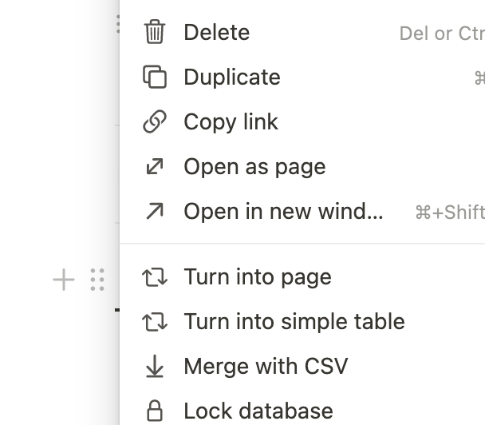

# lm-evaluation-harness-to-csv

Convert JSON files to CSV files to record notion table for using [lm-evaluation-harness](https://github.com/EleutherAI/lm-evaluation-harness).

## Dependency
- pandas

## How to use
### Run script
The script will generate one csv file for specific num_few_shot, step.
```sh
python make_csv.py --model {model} --base {base_dir} --output {output_dir} --step {training_step} --few_shot {number_of_few_shot}
```
### Merge with CSV in Notion
Click the button at the table, and import csv file in table.


## Data hierarchy

origin json output files
```
- results
    - metrics1
        - acc or f1 or etc...
    - metrics2
    - metrics3
    - metrics4
- versions
- config
```
csv file(round(4), macro-f1)
```
Task        0-shot  5-shot  10-shot 50-shot 1-shot
metric1     ##      ##      ##      ##      ##
metric2     ##      ##      ##      ##      ##
metric3     ##      ##      ##      ##      ##
metric4     ##      ##      ##      ##      ##
```